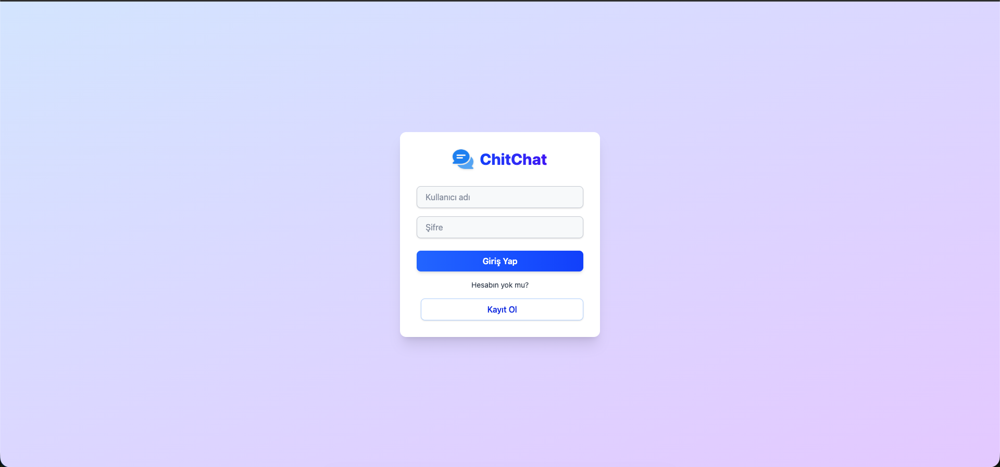
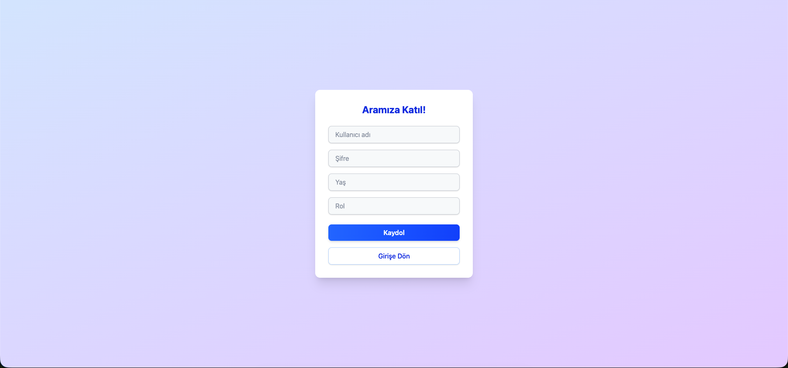
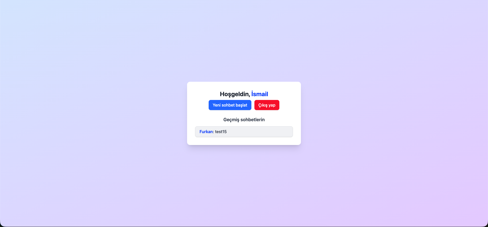

# 💬 ChitChat — Real-Time Messaging Application

> A modern, lightweight, and secure real-time chat application built with **Java Spring Boot** and **JavaScript**.

🌐 **Live Demo:** [chit-chat-zeta-dun.vercel.app](https://chit-chat-zeta-un.vercel.app)
📦 **Repository:** [github.com/ismailcolakk13/ChitChat](https://github.com/ismailcolakk13/ChitChat)

---

## 📸 Screenshots

### Login Screen



> Clean and minimal login interface with username & password authentication.

---

### Registration Screen



> Easy sign-up with username, password, age, and role fields.

---

### Dashboard / Home



> Personalized welcome screen with past conversation history and quick actions.

---

### Start New Chat


> Initiate a new conversation by entering a recipient's phone number or email address along with an opening message.

---

### Chat View


> Real-time message exchange with a clean bubble-based UI — sent messages on the right, received on the left.

---

## ✨ Features

### 🔐 Authentication

- User registration with **username**, **password**, **age**, and **role** fields
- Login with username and password
- Session-based authentication — users remain logged in across the session
- Logout functionality accessible directly from the dashboard

### 💬 Messaging

- **Real-time chat** powered by WebSocket (STOMP protocol)
- One-to-one private messaging
- Start a new conversation by entering a recipient's **phone number or email**
- Send an **opening message** when initiating a new chat
- Message bubbles with clear sender/receiver distinction (blue for sent, white for received)
- Emoji support in messages 🎉

### 🏠 Dashboard

- Personalized greeting: **"Hoşgeldin, [Username]"**
- **Chat history** panel showing recent conversations with latest message preview
- **New Chat** button for quick conversation initiation
- One-click **logout** from the dashboard

### 🗂️ Chat Room

- Room-based chat architecture — each conversation has its own room
- Displays the name of the person you're chatting with in the header
- Back navigation (`<`) to return to the dashboard
- Persistent chat history loaded on room entry

---

## 🛡️ Security

| Feature                | Details                                                                                             |
| ---------------------- | --------------------------------------------------------------------------------------------------- |
| **Password Handling**  | Passwords are entered through a masked input field; stored securely on the backend                  |
| **Session Management** | Authenticated sessions control access to all chat features                                          |
| **Route Protection**   | Unauthenticated users cannot access chat or dashboard screens                                       |
| **Input Validation**   | Registration and login forms validate required fields before submission                             |
| **Role-Based Access**  | Users register with a defined role, enabling role-aware access control                              |
| **WebSocket Security** | WebSocket connections are established only for authenticated users                                  |
| **CORS Configuration** | Backend is configured with controlled Cross-Origin Resource Sharing policies                        |
| **Docker Isolation**   | The application is containerized using Docker Compose, isolating services from the host environment |

---

## 🛠️ Tech Stack

| Layer                | Technology                          |
| -------------------- | ----------------------------------- |
| **Backend**          | Java, Spring Boot                   |
| **Frontend**         | JavaScript (React / Vanilla JS)     |
| **Real-Time**        | WebSocket, STOMP Protocol           |
| **Database**         | PostgreSQL (via Spring Data JPA)    |
| **Containerization** | Docker, Docker Compose              |
| **Deployment**       | Vercel (Frontend), Docker (Backend) |

---

## 🚀 Getting Started

### Prerequisites

- Java 17+
- Node.js & npm
- Docker & Docker Compose

### Run with Docker

```bash
git clone https://github.com/ismailcolakk13/ChitChat.git
cd ChitChat
docker-compose up --build
```

### Run Manually

```bash
# Backend
cd backend
./mvnw spring-boot:run

# Frontend
cd frontend
npm install
npm run dev
```

---

## 📁 Project Structure

```
ChitChat/
├── backend/          # Java Spring Boot application
├── frontend/         # JavaScript frontend
├── docker-compose.yml
└── .gitignore
```

---

## 📄 License

This project is open source. Feel free to fork, contribute, or build on top of it.

---

_by [ismailcolakk13](https://github.com/ismailcolakk13)_
